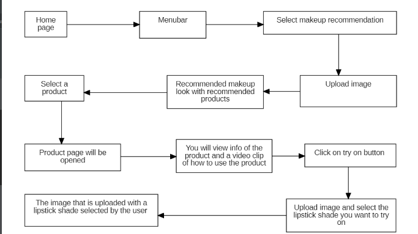

# Hey, Hi:wave: We are Team **Beyond Infinity**

## About the Project :memo:
The project is about the recommendation of makeup based upon the skin tone and the occasion as per the user requirement and the user can try the products virtually by uploading photos in [myntra](https://www.myntra.com/) website.

## Built with 
The project is built with some technologies:
1. Web Technologies 
   - HTML, CSS
2. Web frameworks
   - [flask](https://pypi.org/project/Flask/)
3. Programming Languages
   - Python (Libraries - [pandas](https://pandas.pydata.org/docs/), [numpy](https://numpy.org/), [opencv](https://opencv.org/), [dlib](http://dlib.net/) etc) 
   - JavaScript

## How to use :question:
Here is a flow chart how to access the application

